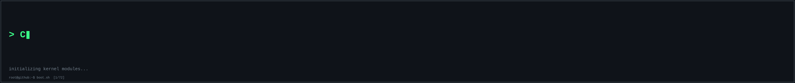
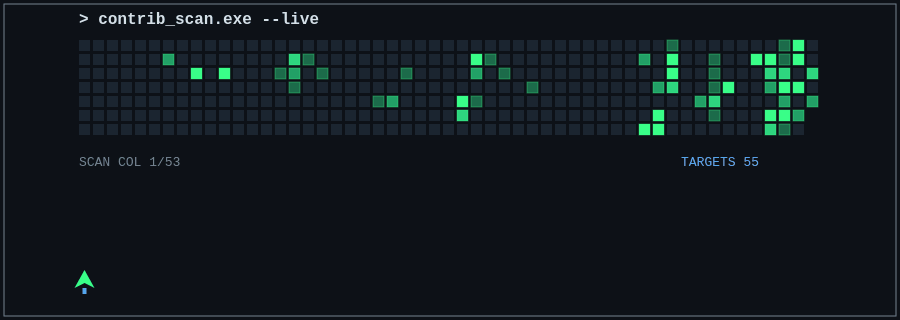
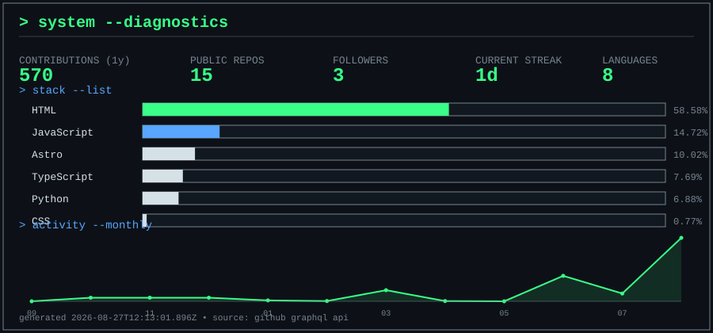

<!--UPDATED:START-->
_Last synced: 2026-08-27T12:16:40.921Z • 570 contributions • 15 public repos_
<!--UPDATED:END-->

---

### `whoami`

```
BSc Artificial Intelligence — Oxford Brookes
Python · PowerShell · Bash · C++ · HTML/CSS
Focus: automation, ML systems, root-cause tooling, builder at heart

LOCATION .......... UK
STATUS ............ ONLINE
```

---

### contribution arcade



---

### `ps --projects`

<!--PROJECTS:START-->
| PID | PROJECT | TYPE | STATUS |
|-----|---------|------|--------|
| 1000 | [GRAVITY-OS](https://github.com/CodeCreatorManMike/GRAVITY-OS) | HTML | RUNNING |
| 1001 | [PawPackPantry](https://github.com/CodeCreatorManMike/PawPackPantry) | TypeScript | RUNNING |
| 1002 | [Kit-Bin](https://github.com/CodeCreatorManMike/Kit-Bin) | Astro | RUNNING |
<!--PROJECTS:END-->

---

### `stack --list` / system diagnostics



---

### `help`

```
$ help
  about       -> see 'whoami' above
  projects    -> see 'ps --projects' above
  stack       -> see 'stack --list' above
  activity    -> see contribution arcade above
  github      -> https://github.com/CodeCreatorManMike
  contact     -> <!-- add LinkedIn/contact link here -->
```

`SESSION ACTIVE • CODECREATORMANMIKE`
